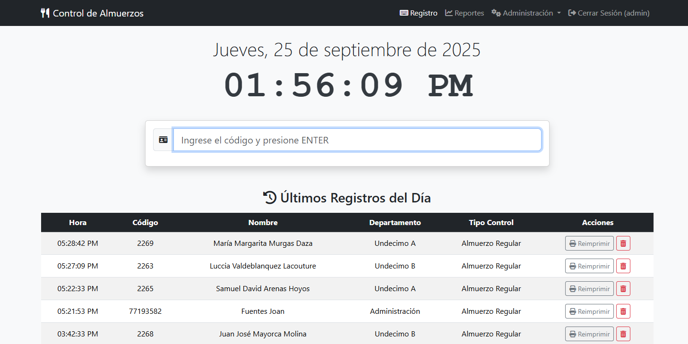

# Sistema de Control de Almuerzos 🍽️

Una aplicación web completa desarrollada con Python y Flask para la gestión y control de la entrega de almuerzos en un colegio privado. La aplicación está diseñada para ser robusta, segura y fácil de usar tanto para operadores como para administradores.



---

## ✨ Características Principales

La aplicación cuenta con un conjunto completo de herramientas para una gestión eficiente:

### Gestión de Datos Maestros (CRUD)
-   **Personas:** Administración completa de estudiantes, docentes y personal, incluyendo toma de fotos desde la webcam o carga de archivos.
-   **Departamentos:** Creación y gestión de los departamentos del colegio.
-   **Tipos de Persona:** Clasificación de personas (ej. Estudiante, Docente).
-   **Tipos de Control:** Definición de los tipos de almuerzo (ej. Regular, Dieta Especial, No aplica).

### Control de Acceso y Registro
-   **Formulario de Registro Rápido:** Interfaz optimizada para el operador, con ingreso por código y tecla ENTER.
-   **Reloj en Tiempo Real:** Fecha y hora visibles en formato grande para una fácil referencia.
-   **Validación de Duplicados:** Evita que una persona registre su almuerzo más de una vez al día.
-   **Reglas de Negocio:** Valida si una persona tiene permitido o no tomar almuerzo según su "Tipo de Control".
-   **Impresión de Tickets:** Genera e imprime automáticamente un ticket con los datos del registro, un código QR, y el encabezado del colegio. La impresión se puede habilitar/deshabilitar.

### Administración y Seguridad
-   **Gestión de Usuarios y Roles:** Dos roles predefinidos (Administrador y Operador) con permisos diferenciados.
-   **Configuración Dinámica:** El administrador puede cambiar parámetros de la aplicación (como la impresión de tickets) desde la interfaz web.
--   **Importación Masiva desde CSV:** Permite crear y/o actualizar los datos de Personas y Departamentos cargando un archivo CSV, con validaciones robustas y manejo de errores.
-   **Backup y Restauración:** Herramienta para que el administrador pueda crear copias de seguridad de la base de datos (en el servidor o para descargar) y restaurarlas.

### Reportes
-   **Generador de Reportes:** Sistema de filtrado para generar reportes de registros por:
    -   Persona
    -   Rango de fechas
    -   Tipo de Control
    -   Departamento
    -   Tipo de Persona

---

## 🔧 Pila Tecnológica (Tech Stack)

-   **Backend:**
    -   **Python 3.x**
    -   **Flask:** Microframework web principal.
    -   **Flask-SQLAlchemy:** ORM para la interacción con la base de datos.
    -   **Flask-Migrate:** Para manejar las migraciones del esquema de la base de datos.
    -   **Flask-Login:** Gestión de sesiones de usuario.
    -   **Flask-WTF:** Creación y validación de formularios.
    -   **Flask-Bcrypt:** Hashing seguro de contraseñas.
-   **Base de Datos:**
    -   **SQLite:** Base de datos por defecto, ideal para desarrollo y despliegues sencillos.
-   **Frontend:**
    -   **HTML5 / CSS3 / JavaScript**
    -   **Bootstrap 5:** Para un diseño profesional y responsivo.
    -   **jQuery:** Para simplificar la manipulación del DOM.
    -   **Fetch API:** Para la comunicación asíncrona con el backend en el registro.
-   **Librerías Adicionales:**
    -   `python-dotenv`: Para la gestión de variables de entorno.
    -   `qrcode`: Para la generación de códigos QR en los tickets.

---

## 🚀 Instalación y Puesta en Marcha

Sigue estos pasos para poner en funcionamiento la aplicación en un entorno local.

### Prerrequisitos
-   Python 3.8 o superior.
-   `pip` y `venv`.

### 1. Clonar o Descargar el Repositorio
```bash
git clone https://tu-repositorio.com/control_almuerzos.git
cd control_almuerzos
```
### 2. Crear y Activar un Entorno Virtual
```bash
# Crear el entorno virtual
python -m venv .venv

# Activar en Windows
.venv\Scripts\activate

# Activar en macOS/Linux
source .venv/bin/activate
```
### 3. Instalar las Dependencias
Con el entorno virtual activado, instala todas las librerías necesarias.
```bash
pip install -r requirements.txt
```
### 4. Configurar las Variables de Entorno
Crea una copia del archivo de ejemplo .env.example y renómbrala a .env.
```bash
# En Windows
copy .env.example .env

# En macOS/Linux
cp .env.example .env
```
Abre el archivo .env y ajusta la SECRET_KEY si lo deseas.
### 5. Inicializar la Base de Datos
Estos comandos crearán el archivo de la base de datos y todas las tablas necesarias. Ejecútalos en orden.
```bash
# (Solo la primera vez) Inicializa la carpeta de migraciones
flask db init

# Crea el archivo de migración inicial
flask db migrate -m "Migracion inicial de la base de datos"

# Aplica la migración para crear las tablas
flask db upgrade
```
### 🏃‍♀️ Ejecutar la Aplicación
Una vez que la base de datos está inicializada, puedes iniciar el servidor de desarrollo.
```bash
python run.py
```
El script creará automáticamente los roles ("Administrador", "Operador") y un usuario administrador por defecto la primera vez que se ejecute.
Abre tu navegador y ve a: **http://127.0.0.1:5000**
## Credenciales por Defecto
- **Usuario:** admin
- **Contraseña:** admin 

¡Importante! Se recomienda cambiar la contraseña del usuario admin inmediatamente después del primer inicio de sesión.
### 🗺️ Posibles Mejoras Futuras
- **Dashboard de Administrador:** Una página principal con gráficos y estadísticas (almuerzos por día, distribución por tipo de persona, etc.).
- **Tablas Interactivas:** Implementar DataTables.js para búsqueda, paginación y ordenamiento en las tablas de administración.
- **Gestión de Saldos:** Añadir un sistema de créditos o saldo para cada persona que se descuente con cada almuerzo.
- **Registro de Auditoría:** Un log que registre acciones críticas como eliminaciones, restauraciones de backups y cambios de roles.
- **Despliegue en Producción:** Configurar la aplicación para un servidor real usando Gunicorn y Nginx.